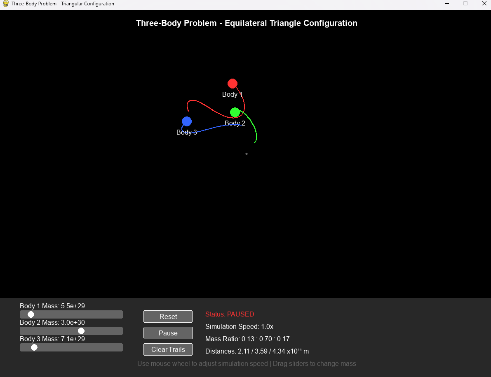

### Three-Body Problem Simulator (Python + Pygame)

A fully interactive simulation of the Three-Body Problem, featuring configurable masses, real-time physics, trajectories, GUI sliders, and simulation speed control.
This project visualizes how three gravitational bodies influence each other in a chaotic orbital system.

## 🚀 Features
✔ Real Physics

Uses Newton’s Law of Universal Gravitation

F=G*(m1*m2)/r^2

Numerical integration with adjustable time step

Bodies influence each other simultaneously

# ✔ Interactive Controls

Sliders to change each body’s mass (1e28 → 5e30 kg)

Buttons:

Reset simulation

Pause / Resume

Clear orbital trails

Mouse Wheel adjusts simulation speed (0.1× → 10×)

# ✔ Visualization

Smooth trails that show orbital paths

Names displayed near planets

Distances and mass ratios shown in real time

Equilateral-triangle initial configuration for stable starting orbits

# ✔ Clean UI

A dedicated control panel

Big simulation area (1200×900)

Smooth 60 FPS drawing

## 🔭 What Is the Three-Body Problem?

The Three-Body Problem studies the motion of three masses interacting through gravity.
It was first formulated by Isaac Newton, but:

## ❗ Why isn’t it solved?

Because there is no general closed-form solution.
The system becomes chaotic, meaning:

small changes in mass

small changes in initial velocity

small changes in position
→ cause completely different orbits.

This simulation demonstrates that chaos visually.

🛠 Installation
Requirements
python 3.8+
pygame
numpy

Install dependencies
pip install pygame numpy

▶ Run the Simulation
python main.py

# 🎮 Controls
🖱 Mouse

Drag slider handles → modify mass of each body

Scroll wheel → increase/decrease simulation speed

# 🟦 Buttons
Button	Action
Reset	Restart with current slider mass values
Pause	Freeze / resume the simulation
Clear Trails	Remove orbit paths
Displayed Info

Simulation status (running / paused)

Speed multiplier

Mass ratios (normalized)

Distance between all three bodies

## 🧪 Code Structure Explained
Body Class

Handles:

position & velocity update

gravity calculation

trails

rendering

Gravity is applied using:

force = G * m1 * m2 / (distance**2 + 1e5)  

The 1e5 avoids division by zero.

Slider Class

A minimal GUI slider to:

draw the bar

move the handle

map mouse position → numerical value

Button Class

Simple rectangle with text and click detection.

Simulation Loop

Read events

Update physics (unless paused)

Draw bodies, trails, UI

Show distances and ratios

Run at 60 FPS

Initial Configuration

The bodies start in an equilateral triangle with tuned velocities that create semi-stable rotation.

